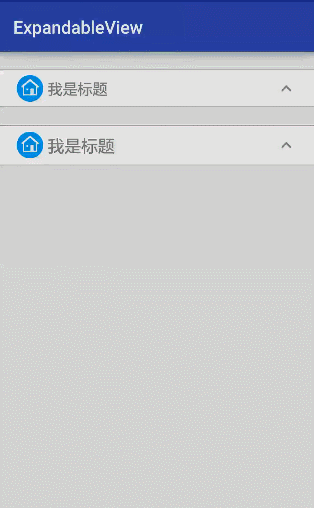

# ExpandableView
android ExpandableView能够让子View隐藏和展开，伸缩菜单



```
 <com.limxing.expandableview.view.ExpandableView
        android:layout_width="match_parent"
        android:layout_height="wrap_content"
        android:layout_marginTop="20dp"
        expandableView:viewTitle="我是标题"
        expandableView:viewTitleSize="15sp"
        expandableView:viewTitleImage="@drawable/fwxinxi">
        
        <..anything you want../>
</com.limxing.expandableview.view.ExpandableView>

```

Attributes：
```
      <attr name="viewTitleShow" format="boolean" />  默认展开还是隐藏
      <attr name="viewTitleColor" format="color" />   标题颜色
      <attr name="viewTitleSize" format="dimension" />标题大小
      <attr name="viewTitleLineColor" format="color" />分割线颜色
      <attr name="viewTitleBacColor" format="color" />背景色
      <attr name="viewTitleImage" format="reference" />标题前面的图片
      <attr name="animDuration" format="integer" /> 动画时长
      <attr name="expandDrawable" format="reference" />右侧三角自定义图片
      <attr name="collapseDrawable" format="reference" />右侧三角自定义图片
```
